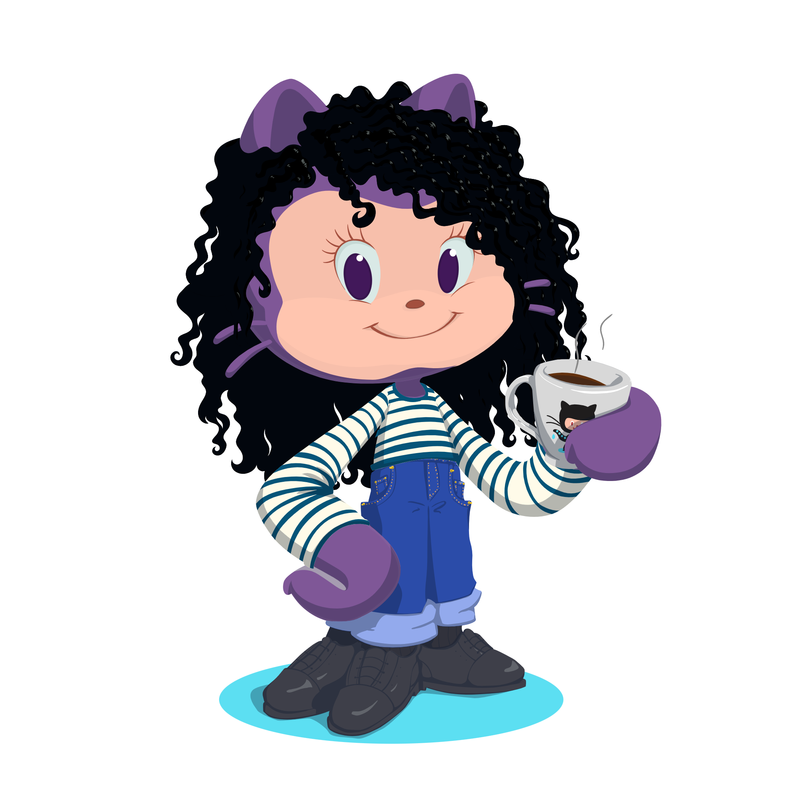

# 👩‍💻👋 Hello, fellow coders!

```javascript
const aboutMe = {
  name: "Beatriz Gabriela",
  role: "Passionate about continuous learning",
  motto: "Always in pursuit of knowledge, and the key to my productivity? A good coffee, of course!",
  currentFocus: "Pursuing a degree in Analysis and Systems Development at SPTech School",
  coffeePreference: "Always strong, hot, and with sugar",
  hobbies: ["Coding", "Exploring new technologies", "Tasting coffees from around the world"],
};
```
  
## Learning Technologies

<div style="display: inline-block">
  
  
  
  
  
 </div>

<br><div align="center">
    
    
    
</div>


